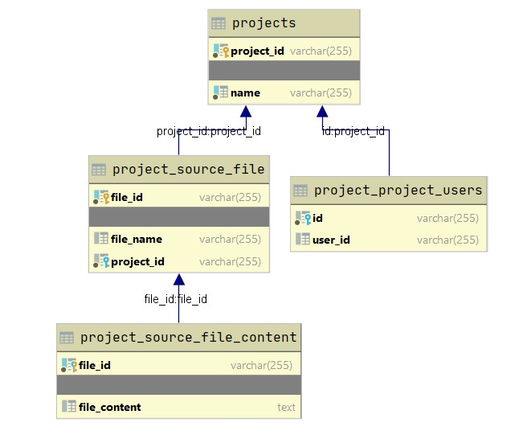

# Integrated Development Environment

This project, an Integrated Development Environment (IDE), is a web-based application that allows the users to create 
and develop projects using their favorite programming language. The users can login to this platform using their LRZ
Gitlab accounts. After a successful login, the user can then create a project, and share it with different users. 
This application is deployed on Google Cloud Platform (GCP). The rest of this Readme will provide detailed information 
regarding the design of the application and the technologies used to build this web-based application.

Deployment URL: http://35.234.93.221/

## Setup
### Requirements
In order to build and run this project locally, below are needed:

maven 3.6.3 or higher: https://maven.apache.org/download.cgi#downloading-apache-maven-3-6-3  
Docker: https://docs.docker.com/engine/install/  
Docker-compose: https://docs.docker.com/compose/install/

### Steps to build locally and run
In order to run the whole project execute following commands on root directory:

mvn clean install  
docker-compose -f docker-compose.yml build  
docker-compose -f docker-compose.yml up

### Steps to pull remote docker images and run (requires login to gitlab container registry)
docker login gitlab.lrz.de:5005/ase20-group5-8/onlineide -u USERNAME -p PASSWORD  
docker-compose -f docker-compose.prod.yml pull  
docker-compose -f docker-compose.prod.yml up

### Validate run
After waiting for some time for all the services getting registered in service-registry and accessible, go to http://localhost on your browser. If everything goes well, home page should be visible.

### Deployment
In each commit to any branch, CI agent builds, packages and deploys the docker images to GitLab container registry.

In each merge to master branch, CI agent builds, packages and deploys the docker images to GitLab container registry. Then connects to remote machine (a GoogleCloud VM) via ssh, pulls the latest docker images and runs them. Hence, latest changes are reflected in the remote server.

## Architecture Design
This section details the design process of the project and how we used the appropriate software engineering techniques 
to solve encountered problems.

### Component Diagram

### Application Layer Diagram

### Database Diagram

## Technology Stack
During the development process of this application, we have followed and applied a microservices architecture style. 
In which we have integrated a set of different technologies that interact with each other via REST APIs. The following
diagram shows the different microservices running on Google Cloud Platform.

